# Flood extent and flooded cropland from Sentinel-1, Brahmaputra valley, August 2016

Mapping flood water with radar is not hard. Saying how much of the answer comes
from the imagery and how much comes from choices nobody declares is harder, and
that is what this project is about.

**Between 119,779 and 170,625 ha of flood water** on 12 August 2016 across 6.26
million hectares of the central Brahmaputra valley, of which **between 46,943
and 87,127 ha was cropland**.

That range is not measurement noise. It is the gap between two operating points
that both have an argument behind them: one chosen to maximise agreement with
hand labels pixel by pixel, the other chosen so the mapped area is unbiased
against those labels. They differ by one decibel. Every figure in this README is
reported with the decision that moves it and the amount it moves by.

Interactive map: `docs/index.html` (GitHub Pages ready)

This repository has been through a methodological audit. `REVIEW.md` lists every
finding with its severity and evidence, including three that remain open.
`CHANGELOG.md` records every number that changed as a result, with the
superseded value and why it was wrong.

| | |
|---|---|
| Sensor | Sentinel-1 IW GRD, RTC gamma0, VH |
| Dates | 7, 12 and 31 August 2016 |
| Resolution | 20 m |
| Method | Speckle-filtered single-date threshold, −18.75 or −17.75 dB |
| Validation | Sen1Floods11 hand labels, 65 chips, official splits |
| Data | Open only: Microsoft Planetary Computer, JRC, ESA, geoBoundaries |

---

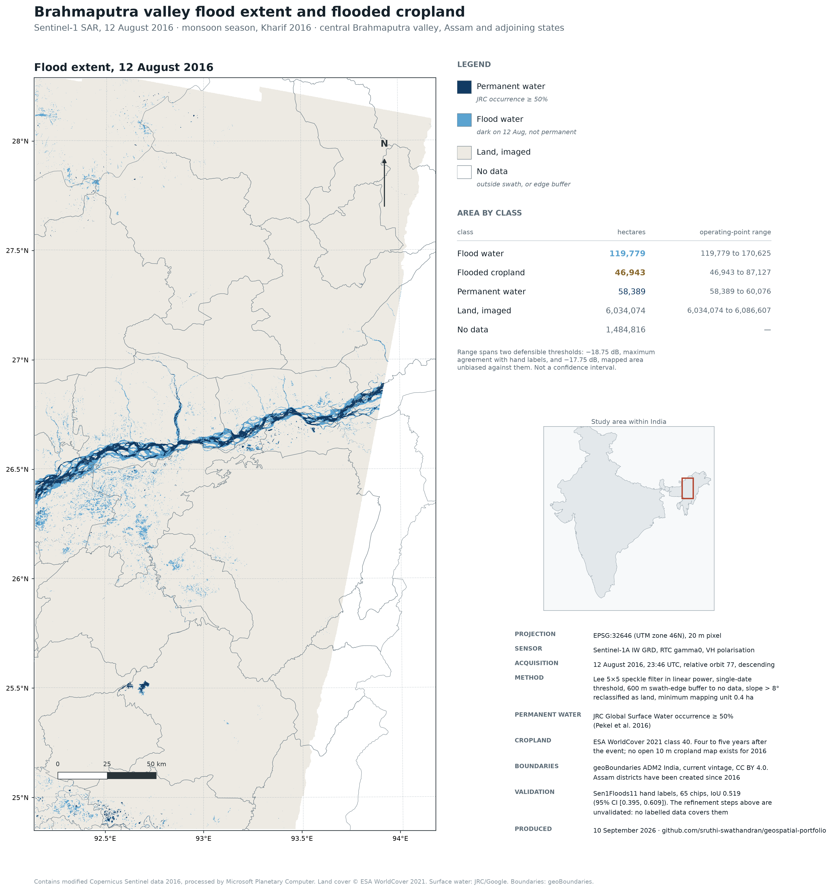

*Flood extent on 12 August 2016 at 20 m, after the swath edge buffer, the slope cut and the minimum mapping unit. Full resolution version in `results/figures/flood_extent_map.pdf`.*

## Flooded cropland by district, 12 August 2016

| District | Flooded cropland | Flood water | Cropland imaged | District imaged |
|---|---:|---:|---:|---:|
| Nagaon | 13,428 ha | 17,244 ha | 128,978 ha | 100% |
| Morigaon | 11,336 ha | 15,829 ha | 75,691 ha | 84% |
| Sonitpur | 4,523 ha | 28,464 ha | 137,015 ha | 100% |
| Biswanath | 3,201 ha | 14,184 ha | 76,739 ha | 100% |
| Hojai | 3,177 ha | 3,367 ha | 72,312 ha | 100% |
| Golaghat | 1,746 ha | 7,703 ha | 40,793 ha | 36% |
| Cachar | 1,454 ha | 2,004 ha | 31,994 ha | 49% |
| Darrang | 1,292 ha | 8,387 ha | 20,794 ha | 30% |
| Udalguri | 1,285 ha | 1,904 ha | 35,789 ha | 32% |

Full table in `results/district_flood_stats.csv`. The last column is the share
of the district the satellite swath actually saw. Rows below 50% are marked
PARTIAL and below 15% SLIVER in the console output of `district_stats.py`,
because a percentage computed over a sliver is arithmetic rather than evidence.

These rows sum to 110,081 ha of flood and 43,494 ha of flooded cropland, which
is 92% of the scene-wide totals quoted above. The remainder falls outside every
Indian district polygon. Scene-wide figures are in `results/cropland_scene.csv`.

**Flood area and flooded cropland are not the same story.** Sonitpur has the
largest flood of any district at 28,464 ha, and only 16% of it is on cropland,
against 78% in Nagaon. Sonitpur sits where the braid belt is widest, so most of
its water is in sand and channel. Relief allocated by flood area would go to
Sonitpur; relief allocated by flooded cropland would go to Nagaon.

---

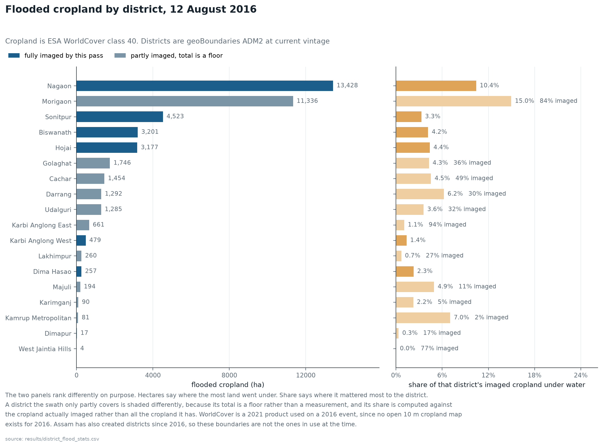

*Flooded cropland by district on 12 August 2016. Cropland is ESA WorldCover class 40.*

## Two operating points, one bracket

The threshold was chosen twice, against two criteria, and both are defensible.

| | Map-optimal | Area-matched |
|---|---:|---:|
| Threshold | −18.75 dB | −17.75 dB |
| Chosen to | maximise IoU on the valid split | make mapped area unbiased against labels |
| Chip-scale IoU, all 65 | 0.519 | 0.522 |
| Chip-scale mapped water | 14,405 ha (−22.1% vs labels) | 18,422 ha (−0.3%) |
| Full scene, raw threshold | 217,490 ha | 319,398 ha |
| Full scene, refined | 119,779 ha | 170,625 ha |
| Flooded cropland | 46,943 ha | 87,127 ha |

The two are statistically indistinguishable on the chips: 0.519 and 0.522, well
inside a confidence interval of ±0.11. They differ by 42% on flood area and 86%
on flooded cropland.

A map user wants the first. Anyone buying a hectare figure wants the second,
because the first recovers only 78% of hand-labelled water. Publishing one
without saying which is how a flood map ends up quoted for a purpose it was
never tuned for, and earlier versions of this README did exactly that: they gave
a hectare figure computed at the map-optimal point.

**The ranking is robust even though the magnitude is not.** Nagaon, Morigaon and
Sonitpur are first, second and third at both thresholds. Below that the order
shuffles; Karbi Anglong East moves from tenth to sixth. Who was worst affected
survives the choice. How much does not.

Full area-matched outputs are in `results/district_flood_stats_areamatched.csv`
and `results/fullscene/India_water_20m_areamatched_refined.tif`.

---

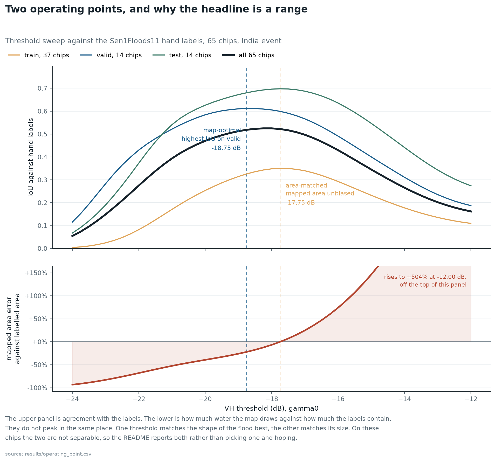

*IoU against the Sen1Floods11 hand labels across the threshold sweep. The map-optimal point maximises IoU on the validation split. The area-matched point is where mapped area stops running short of the labelled area. On these chips the two are not separable, which is why the headline is a bracket rather than a number.*

## Three dates, and what the flood did between them

Three Sentinel-1 acquisitions were mapped separately and never mosaicked.

Each was produced at both operating points, so the range below is the same
threshold choice described above rather than a new source of uncertainty.

| Date | Orbit | Imaged | Flood | Flooded cropland |
|---|---:|---:|---:|---:|
| 7 Aug 2016 | 4 | 3.17 M ha | 64,704 to 90,915 ha | 30,035 to 52,882 ha |
| 12 Aug 2016 | 77 | 6.26 M ha | 119,779 to 170,625 ha | 46,943 to 87,127 ha |
| 31 Aug 2016 | 4 | 3.16 M ha | 38,887 to 44,991 ha | 5,776 to 9,256 ha |

Imaged area is measured after the 600 m swath-edge buffer has been set to no
data, so it is smaller than the raw classified area quoted in the runtimes table
further down.

The footprints differ, so those flood totals are not directly comparable. The 7
and 31 August passes are on the same relative orbit, which means identical
footprint and identical viewing geometry, so their comparison is close to pure
hydrology:

```
                          map-optimal      area-matched
flood, 7 Aug                64,615 ha         90,785 ha
flood, 31 Aug               38,887 ha         44,991 ha
drained over 24 days        27,843 ha         48,950 ha
newly flooded                2,114 ha          3,157 ha
persistence                     56.9%             46.1%
net change                   to 60.2%          to 49.6%
direction              receding 13.2:1   receding 15.5:1
```

**Total flood fell 40% or 50% over those 24 days, depending on the operating
point. Flooded cropland fell 80.8% or 82.5%.**

That contrast is the point. The total-flood figure moves by ten percentage
points across a threshold choice; the cropland figure moves by less than two.
The interpretive claim, that fields drain while channels do not, is robust to a
decision that shifts total flood area by 42%.

The water that persists is not on fields. Golaghat shed 90% of its flooded
cropland; Majuli shed 50% while its total flood barely moved at all, 16,453 ha
down to 15,304. Fields drain within about three weeks; channels, chars and low
wetland do not.

Peak extent is the number that gets reported. Duration is the number that
damages a rice crop. Golaghat had the largest peak crop exposure in this area
and almost none of the duration. Majuli had a tenth of the peak and held it.

One prediction recorded because it was wrong. Loosening the threshold by a
decibel was expected to sweep in terrain and edge noise. On 7 August it did the
opposite: of the 26,211 ha it adds, 22,847 ha is cropland, 87% of it. Partially
inundated fields with emergent crop sit at intermediate backscatter and are
exactly what a small relaxation captures. On 31 August, with the crop drained,
only 57% of the added water is cropland. How threshold-sensitive a flood map is
depends on how much of the flood is sitting in vegetation.

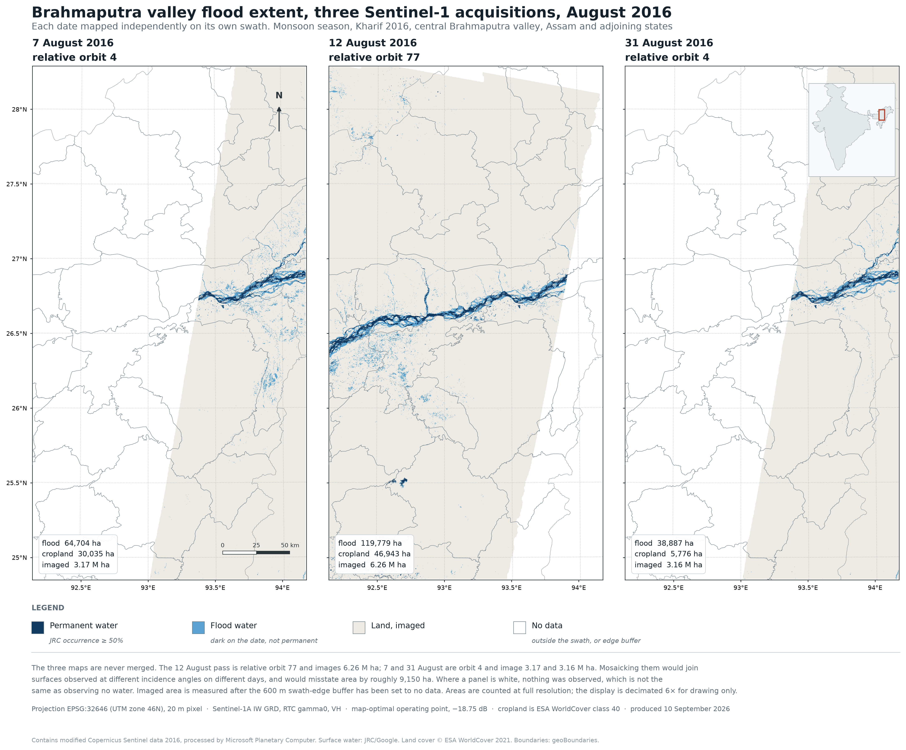

*The three acquisitions on one projection and one scale, each mapped only on
the ground its own pass saw. Where a panel is white nothing was observed,
which is not the same as observing no water. The 12 August pass is relative
orbit 77 and images 6.26 M ha while the other two are orbit 4 and image 3.17
and 3.16 M ha, which is why 7 and 31 August are compared against each other on
their shared ground rather than against 12 August. Imaged area throughout is
measured after the 600 m swath-edge buffer has been set to no data.*

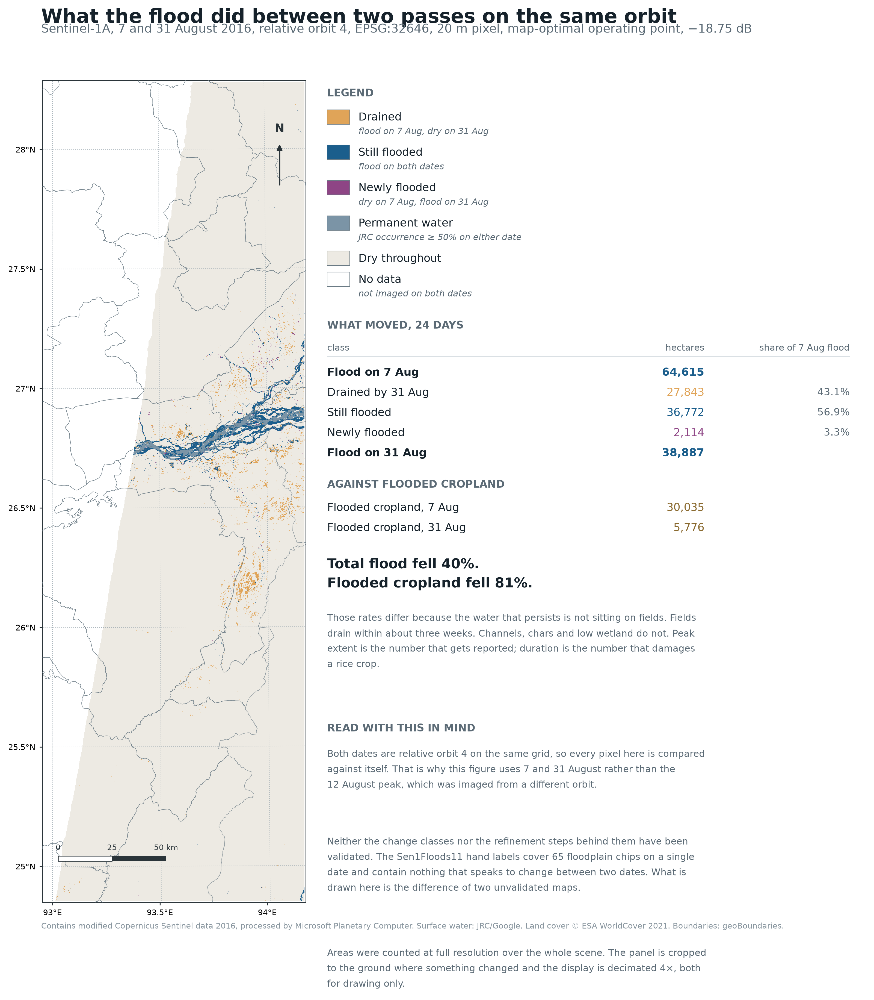

*The same relative orbit twice, 24 days apart, so every pixel is compared
against itself rather than against a different viewing geometry. Total flood
fell 40% over those 24 days while flooded cropland fell 81%. The water that
persists is in channels, chars and low wetland rather than on fields, which
drain in about three weeks. Peak extent is the number that gets reported and
duration is the number that damages a rice crop. Neither the change classes
nor the refinement steps behind them have been validated against anything.*

### Why the three maps are not merged into one

Filling the 12 August map's eastern gap with 7 August data would produce a
seamless-looking picture describing no moment that existed. The cost is
measurable rather than hypothetical. In the 1.82 million hectares both passes
saw, flood fell to 75.1% of its extent in those five days. The 7 August wedge
holds 36,755 ha, so on 12 August it would have been nearer 27,600 ha. **A naive
mosaic would have reported roughly 9,150 ha of water that had already gone**,
about 7.6% of the total, with no visible seam.

---

## How 217,490 becomes 119,779

The raw threshold output over the full scene is 217,490 ha. Three things are
dark to radar without being wet, and each was found by looking at the map rather
than by any metric.

| Step | Removed | Remaining |
|---|---:|---:|
| Raw threshold at −18.75 dB | | 217,490 ha |
| Swath edge buffer, 600 m to no data | 26,223 ha | 191,267 ha |
| Slope above 8° reclassified as land | 68,437 ha | 122,830 ha |
| Connected components under 10 px | 3,052 ha | **119,779 ha** |

**Swath edge.** Flood classification runs at 32.9% of area within the first
600 m of the frame boundary against 3.1% in the interior, measured on the
12 August map by `edge_rate.py` and written to `results/edge_rate.csv`. That is
a contrast of about eleven to one. Earlier versions of this section said 17%
and 1.9%, which came from no file and were not what the rasters say; the decay
distance beyond 600 m is still an impression rather than a measurement. The pattern is unambiguous; the mechanism is most likely incompletely
removed GRD border noise combined with falling return at near and far range, and
that attribution has not been verified against the product documentation. The
buffer becomes no data rather than land, because those pixels are unmeasured
rather than dry. It removes real water where the swath edge crosses wet ground,
and Majuli is the clearest case.

**Terrain.** Permanent water is the control: 99.3% of the Brahmaputra channel
sits below 8° of slope. The mapped flood put 35.8% of itself above that, and
23.6% above 20°, on ground where the river has 0.11% of its area. Beyond 8° the
flood class is over-represented by a factor of 11 in the 8 to 12 degree band,
rising to 330 above 35 degrees, relative to what genuine water does.

**Minimum mapping unit.** A lone 20 m pixel is a noisy sample, not a mappable
flood.

---

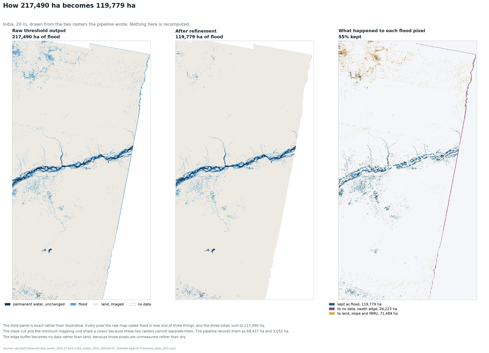

*The raw threshold output beside the refined map. Removing the swath edge, steep terrain and objects below the minimum mapping unit is what takes 217,490 ha down to 119,779 ha. The third panel is exact rather than illustrative: every pixel the raw map called flood is now one of three things, 119,779 ha still flood, 26,223 ha turned to no data inside the swath-edge buffer, and 71,489 ha turned to land under the slope cut and the minimum mapping unit. The slope cut and the minimum mapping unit share a colour because the two rasters alone cannot separate them; the pipeline records them as 68,437 and 3,052 ha.*

## Validation

Scored against Sen1Floods11 hand labels on 65 co-registered chips, using the
official train/valid/test splits, with no-data pixels excluded from every
confusion matrix.

| Method | IoU, all 65 chips | 95% CI | Precision | Recall |
|---|---:|---|---:|---:|
| This pipeline, RTC gamma0 | 0.519 | [0.395, 0.609] | 0.780 | 0.608 |
| This pipeline, on the GEE product | 0.531 | | 0.789 | 0.619 |
| Published S1OtsuLabelHand baseline | 0.531 | | 0.820 | 0.601 |

Intervals are percentile bootstrap resampled over **chips**, not pixels, because
pixels within a chip are strongly autocorrelated and resampling them would give
intervals far too narrow.

Two things the single figure hides.

**Macro IoU is 0.280** against a micro of 0.519, with a standard deviation of
0.249 and a minimum of exactly 0.000. Micro weights by pixel count, so the few
chips holding most of the water carry it. Weighting every chip equally, the
method fails outright on some of them.

**The splits are not exchangeable.** Nothing here is trained, so train, valid
and test are three samples of chips scored by one fixed threshold, and they give
0.326, 0.612 and 0.680. That spread is larger than any method difference
measured anywhere in this project, including the entire Earth Engine to RTC
migration at 0.012. An earlier version of this README quoted the test figure of
0.680. That was the highest of the three and quoting it was cherry-picking; see
`CHANGELOG.md` C-02.

Running the same code on the same product the published baseline used
reproduces its IoU to three decimal places. That is the strongest evidence here
that the implementation is correct, and it means the remaining gap is about
inputs rather than about a bug.

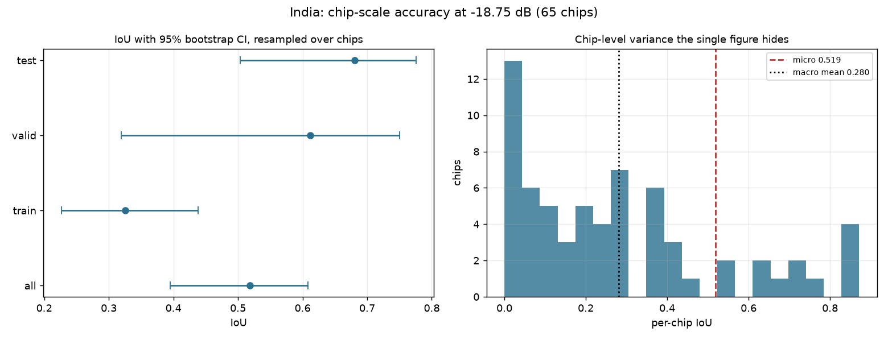

*Per-chip IoU with percentile bootstrap intervals resampled over chips rather than pixels. These figures describe the chip-scale product. They do not describe the full-scene map reported above, which has never been validated against independent labels.*

### What leaving Google Earth Engine costs

The published baseline was built on Earth Engine sigma0. This pipeline uses
Planetary Computer RTC gamma0 and never touches Earth Engine. At matched recall
the precision gap decomposes as:

```
moving from RTC to the GEE product     +0.009
moving from pooled to per-scene Otsu   +0.031
total gap to the published baseline    +0.040
```

So the migration costs about 0.009 of precision and 0.012 of IoU. Separability
explains why it is small: RTC has less contrast (6.10 dB against 7.95) but is
also less noisy (spread 3.10 against 3.89), so d-prime lands at 1.97 against
2.04. Terrain-corrected radiometry is flatter and cleaner rather than worse.

A 5×5 Lee filter is worth +0.038 IoU on its own, comparing each variant at its
own best threshold, a larger effect than the entire platform migration.

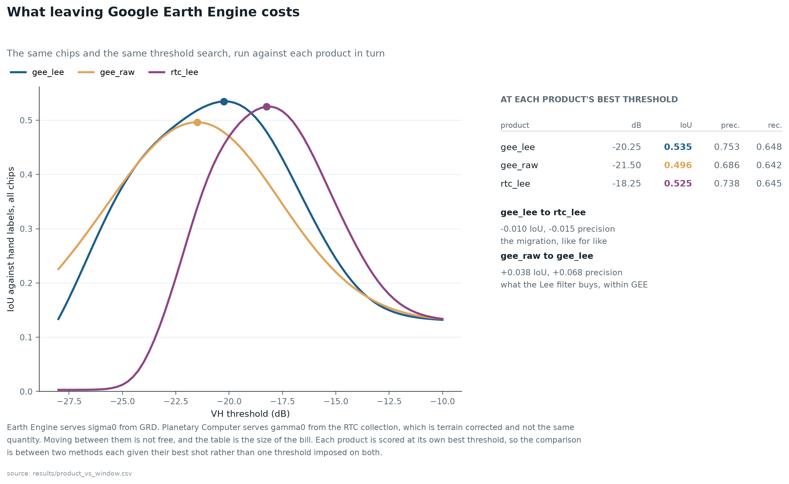

*What the move off Earth Engine costs, measured on the same chips with the same threshold search.*

### Cross-orbit agreement

Orbits 77 and 4 view the same ground at different incidence angles. The two
passes share 1,819,972 ha, and eight tiles covering 729,161 ha of that were
compared. Over land they agree to **0.05 dB**, the pixel-weighted median of the
per-tile median differences, with **0.11 dB of scatter between tiles**, the
standard deviation of those same medians. One threshold serves both orbits, and
that is measured rather than assumed. For anyone building multi-orbit monitoring
on this stack it is a load-bearing fact.

---

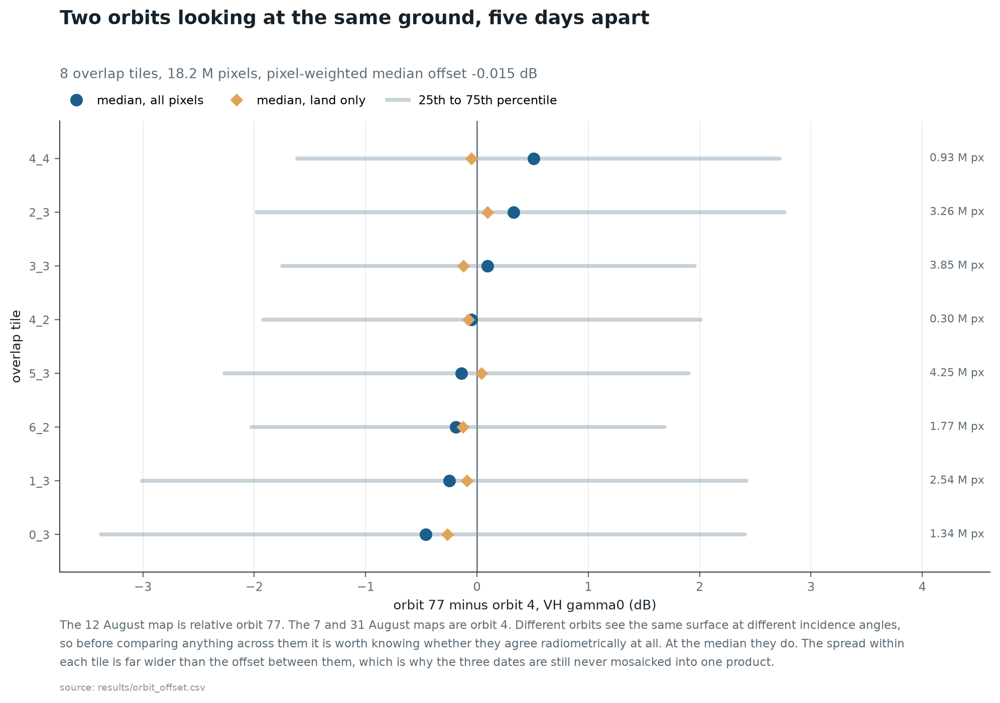

*Backscatter agreement between relative orbits 4 and 77 over the ground they share.*

## What was tried and rejected

### Change detection does not work here

The textbook approach is to difference the flood date against an earlier
reference. It was tested against two references and abandoned.

| Reference | Already wet | IoU | Recall |
|---|---:|---:|---:|
| 19 July 2016, mid-monsoon | 45.1% | 0.069 | 0.086 |
| 14 April 2016, pre-monsoon | 18.7% | 0.178 | 0.295 |
| Single date, no reference | | **0.515** | 0.709 |

Sweeping the change threshold from −12 to +4 dB across four smoothing windows
and both gate settings found the optimum at the point where the change
constraint stops excluding anything. **The best available change configuration is
the one that ignores the change signal.**

With the change signal alone the best the sweep reaches is IoU 0.196, at a
required drop of 2 dB. Relax that requirement to nothing and the same
configuration converges on 0.130, which is what labelling the entire scene as
water scores.

The reason is measurable. At thresholds where the filter actually bites it
deletes true water faster than false positives, 66% against 46% at −3 dB. Between
April and August, 45% of the study area darkened, because the monsoon wet
everything, while the flood covers 13%. The change signal is mostly a seasonal
wetting map with the flood buried inside it.

A related trap: Otsu on a difference image picks a threshold close to zero,
because a difference image has one mode rather than two. Most pixels did not
change, so their difference is speckle minus speckle piled around zero, and the
changed pixels sit in a tail rather than a second peak.

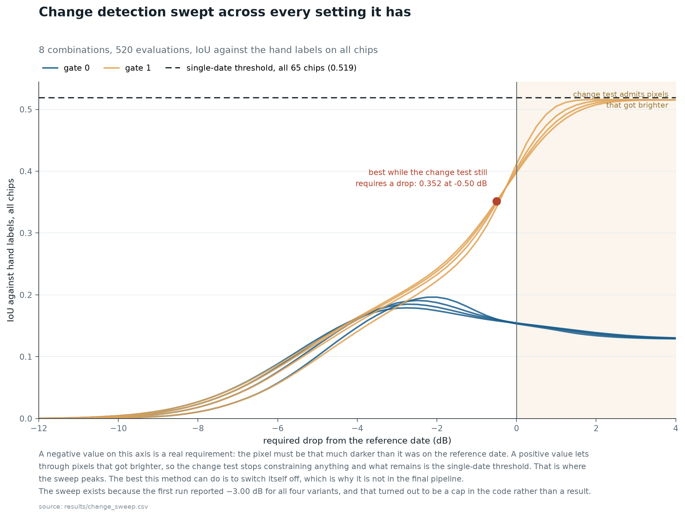

*Change detection swept across the full range of drop thresholds. Nothing in the sweep beats thresholding the flood image on its own, which is why change detection is not in the final method.*

### A slope mask does not help on the validation chips

Swept from 2° to 20°, it moved precision +0.008 for recall −0.003. That result is
correct about the chips and wrong about the scene, and the next section explains
why.

---

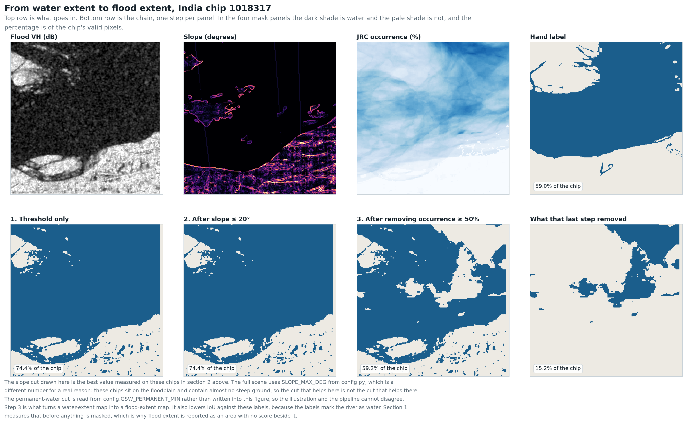

*The chain on a single chip. The top row is what goes in: the flood-date VH image, slope, JRC occurrence and the hand label. The bottom row is each step in turn, threshold alone, then the slope cut, then permanent water removed, then what that last step took out. The slope cut drawn is the best value measured on these chips, which is not the value the full scene uses, and the section above explains why.*

## Where the answer moves without the method changing

Four places, all measured on this event.

| Choice | Range | Effect |
|---|---|---|
| Change-detection reference date | 19 July vs 14 April | 6,161 ha vs 17,575 ha |
| Permanent water definition | JRC occurrence 10% to 90% | 8,893 ha to 19,458 ha |
| Terrain cut | none to 2° | 191,268 ha to 104,958 ha |
| Acquisition date | 7 Aug vs 31 Aug, same ground | 64,615 ha to 38,887 ha |

The terrain-cut row is read from `results/sensitivity_grid.csv`, which is
computed after the swath-edge buffer and before the minimum mapping unit. Both
of its numbers therefore sit one step short of the reported 119,779 ha.

Every one of those is a choice an analyst makes silently and a reader never
sees. On this river the number moves more with the definitions than with the
algorithm.

---

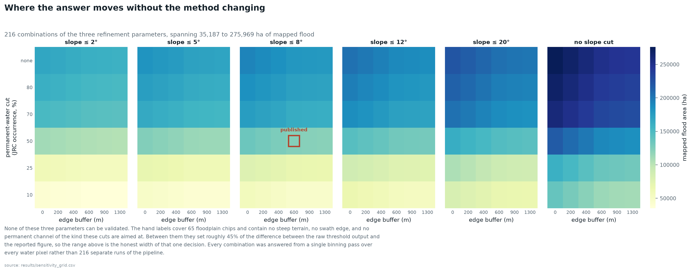

*Mapped flood area across all 216 combinations of slope cut, occurrence cut and edge buffer, answered from a single binning pass over every water pixel rather than 216 separate runs.*

## Three times a conclusion did not survive the full scene

Every finding above from the validation chips was measured correctly and three
of them still failed when the pipeline moved from 65 chips to 63,000 km². All
three failures have the same shape: the validation set was selected around the
flood, so it represents the flood rather than the region.

1. **Otsu window.** Per-scene threshold estimation, worth +0.031 precision on a
   floodplain scene, returned −15.36 dB when run over the whole 200 × 381 km
   rectangle, 3.4 dB too permissive, classifying 53% of the imaged area as
   flood. The AOI contains hills and dry upland the labelled chips never
   sampled.
2. **Slope mask.** Neutral on the chips, because all 65 sit in the floodplain
   and there are no mountains in the validation set. On the full scene it
   removes 68,437 ha of hillside radar shadow.
3. **Swath edge.** Never visible in chip-scale validation at all, because chips
   are interior. It contributed about 26,000 ha of the raw scene total.

All three were caught by looking at the rendered map, not by a metric. That is
worth stating plainly: no score in this repository would have found any of them.

---

## Limitations

- **The study area is not Assam, and it is not only Assam.** The AOI comes from
  the Sen1Floods11 chip footprints. Of the four districts named as worst
  affected in a Sentinel-1 map published on 4 August 2016, it contains two,
  Golaghat and Jorhat, and misses two that lie on either side of it: Bongaigaon
  at 90.4 to 90.9°E and Dhemaji at 94.2 to 95.5°E. Sivasagar, Dibrugarh,
  Tinsukia and Barpeta are also outside. In the other direction the swath
  crosses into Nagaland, Meghalaya, Arunachal Pradesh and Manipur, so the
  district table contains Dimapur, the Jaintia Hills districts, Papum Pare and
  Imphal East among others. Any comparison against an Assam state figure must
  first restrict the sum to Assam districts, which needs a state label the
  current district table does not carry.

- **The headline is an uncorrected map pixel count and is probably low.** At the
  operating point used for the full scene the map recovers 14,405 ha of the
  18,483 ha of hand-labelled water, a shortfall of 22.1%. Scaling the reported
  figure by that ratio gives 153,681 ha, but chip error rates should not
  be assumed to hold over terrain the chips never sampled. A design-based
  estimate with a standard error would need a probability sample of the mapped
  area, which has not been drawn. See `REVIEW.md` F-01 and F-02.

- **No external validation was obtainable.** No contemporaneous district-wise
  inundation product for this event could be retrieved from open archives. The
  ASDMA report archive begins in 2017 and the site was unreachable; the NRSC
  Flood Hazard Zonation Atlas is a multi-year frequency product rather than an
  annual record; and the flood chapter of the Economic Survey, Assam 2016-17
  covers flood control works and expenditure rather than event damage. Outside
  the 65 hand-labelled chips this map is unvalidated. The only external
  cross-check available is of ranking rather than magnitude: of the two
  worst-affected districts that fall inside the study area, both appear at the
  top of the 7 August flooded-cropland table. For scale, the same Economic
  Survey gives Assam's average annual flood-affected area as 9.31 lakh hectares
  across the whole state and a whole season; the 119,779 ha here is one
  satellite pass on one day over part of the state.
- **Land cover date.** ESA WorldCover exists for 2020 and 2021 only. The
  cropland layer is four to five years after this flood and there is no open
  10 m alternative for India in 2016. Land that changed use in between is
  misattributed. The fetched tiles also cover 97.8% of the grid rather than all
  of it, and the uncovered 2.2% is counted as not cropland, so every cropland
  figure here is a floor.
- **District boundaries.** Present-day geoBoundaries ADM2. Assam has created
  districts since 2016, so these will not match a 2016 government bulletin one
  for one.
- **No independent validation of the district figures.** The Sen1Floods11 labels
  cover 65 chips. Nothing here has been checked against Assam State Disaster
  Management Authority bulletins for August 2016, and that comparison is the
  obvious next step for anyone using these numbers.
- **Resolution.** Run at 20 m. The pipeline is resolution-agnostic and 10 m over
  the full AOI is roughly four hours of runtime.
- **Residual false positives.** Scattered water remains in the north-west on
  ground gentle enough to pass the 8° cut. Some of it is probably genuine
  wetland and some is probably shadow in low hills. It has not been separated.
- **Outside India.** 9,698 ha of mapped flood falls outside any Indian district
  polygon, in Bangladesh, Bhutan and the Arunachal border strip.

---

## Data

All open, all licensed for reuse. No proprietary or client data of any kind.

| Layer | Source | Licence |
|---|---|---|
| Sentinel-1 RTC gamma0 | Microsoft Planetary Computer | Modified Copernicus, free reuse |
| Copernicus DEM GLO-30 | Planetary Computer | ESA, free reuse |
| JRC Global Surface Water | Pekel et al. 2016, Planetary Computer | Open |
| ESA WorldCover 2021 | Planetary Computer | CC BY 4.0 |
| Sen1Floods11 labels | Cloud to Street / Google, public GCS bucket | CC BY 4.0 |
| District boundaries | geoBoundaries ADM2, India | CC BY 4.0 |

Imagery is read through STAC with windowed COG requests. No scene is ever
downloaded whole.

---

## Running it

```bash
python -m venv .venv && .venv\Scripts\activate     # Windows
pip install -r requirements.txt
```

Pipeline order. Each script prints what it found and why it matters, and writes
a CSV beside its figure.

| Stage | Script | What it does |
|---|---|---|
| Setup | `config.py`, `chips.py`, `metrics.py` | Every decision with its reasoning; shared I/O and one scoring implementation |
| 1 | `find_scenes.py` | Locate acquisitions for every Sen1Floods11 event |
| 2 | `fetch_labels.py` | Hand labels and official splits |
| 3 | `explore_chips.py` | Inventory, and score the published baseline |
| 4 | `mask_chips.py` | Nine threshold variants, ablated |
| 5 | `threshold_analysis.py` | Class separation and threshold sweep |
| 6 | `ceiling_analysis.py` | Decompose the accuracy ceiling |
| 7 | `fetch_reference.py`, `coregister.py`, `shift_field.py` | RTC onto chip grids, and fix a 10 px offset |
| 8 | `fetch_dem.py`, `mask_terrain_water.py` | Terrain and permanent water |
| 9 | `change_detect.py`, `fetch_dry_reference.py`, `change_sweep.py` | Test change detection and reject it |
| 10 | `operating_point.py`, `product_vs_window.py` | Choose an operating point; price the GEE migration |
| 11 | `full_scene.py`, `refine_scene.py`, `refine_figure.py` | Full scene, tiled and resumable, then artefact removal, and the before and after figure |
| 12 | `district_stats.py`, `cropland_scene.py` | Flooded cropland by district, and scene-wide |
| 13 | `find_swaths.py`, `orbit_offset.py`, `compare_dates.py` | Second and third acquisitions, cross-orbit check, date comparison |
| 14 | `make_map.py`, `make_date_maps.py`, `make_figures.py` | Publication map at 300 dpi, the three-date and recession sheets, and the charts the README carries |
| Audit | `accuracy_ci.py` | Confusion matrix, per-class accuracy, bootstrap intervals |
| Audit | `sensitivity_grid.py` | Reported area across all 216 refinement parameter combinations |
| Audit | `make_manifest.py` | File counts, sizes and SHA-256 digests for reproduction checking |
| Audit | `edge_rate.py` | Flood called inside the 600 m swath-edge buffer against the interior |
| Audit | `cropland_scene.py` | Flooded cropland over the whole raster rather than over district polygons |
| Audit | `refine_figure.py` | The before and after of refinement, rebuilt from the two rasters |
| Audit | `verify_all.py` | Traces every number in README.md and docs/index.html back to results/ |
| Publish | `build_docs_page.py` | Generates docs/index.html and its four map overlays from results/ |

Reproducing the headline figure:

```bash
python src/full_scene.py --res 20
python src/refine_scene.py --res 20 --apply --slope 8 --min-pixels 10
python src/district_stats.py --res 20
```

`results/final_method.json` carries every settled decision with the measurement
behind it, and `full_scene.py` reads its threshold from that file rather than
from a constant.

Expected runtimes, measured on a laptop over a domestic connection. The long
steps are network-bound rather than compute-bound, since every read is a
windowed request against a remote COG.

| Step | Runtime | Output check |
|---|---|---|
| `fetch_labels.py` | ~10 min | 481 files under `data/sen1floods11/` |
| `fetch_reference.py` | ~30 min | 340 files under `data/reference/` |
| `full_scene.py --res 20` | ~25 min | 46 tiles, 6,344,561 ha classified before refinement |
| `refine_scene.py --apply` | ~30 s | 119,779 ha kept as flood |
| `district_stats.py` | ~3 min first run, ~15 s cached | 35 districts, 110,081 ha |
| `accuracy_ci.py` | ~30 s | IoU 0.519, CI [0.395, 0.609] |
| `sensitivity_grid.py` | ~10 min first run | published cell 122,832 ha |
| `make_map.py` | ~1 min | two files in `results/figures/` |

`full_scene.py` records each finished tile and re-signs Planetary Computer asset
URLs every 25 minutes, since the SAS tokens expire in under an hour and a full
pass outlives them. Interrupting it costs one tile.

Run `python src/make_manifest.py` after a clean rebuild and compare
`MANIFEST_files.csv` against the committed copy. Every reported number lives in
a digested CSV or JSON, so a reproduction claim can be checked rather than
asserted.

---

## Licence and citation

Code in this repository is released under the MIT Licence. The data it reads
carry their own terms, listed in the Data section above; the Sentinel-1
derivatives here contain modified Copernicus Sentinel data 2016, processed by
Microsoft Planetary Computer.

Suggested citation:

> Swathandran, S. (2026). *Flood extent and flooded cropland from Sentinel-1,
> Brahmaputra valley, August 2016.* Version 1.1.
> github.com/sruthi-swathandran/geospatial-portfolio

Contact and issues: please open a GitHub issue on this repository.

Version 1.1 supersedes 1.0 after a methodological audit; `CHANGELOG.md` lists
every number that changed and `REVIEW.md` the findings that prompted it.

Long runs are resumable. `full_scene.py` records each finished tile and
re-signs Planetary Computer asset URLs every 25 minutes, since the SAS tokens
expire in under an hour and a full pass outlives them.
