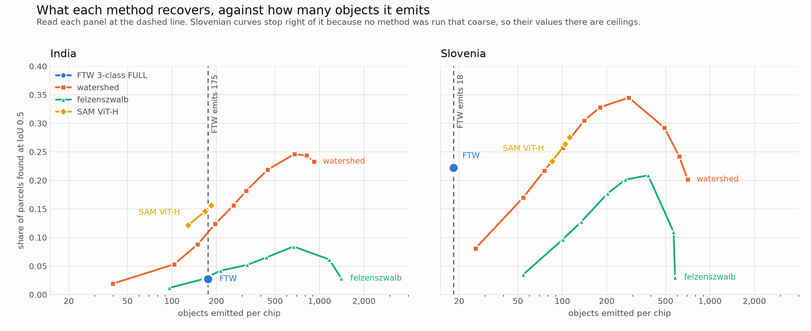

# Field boundaries for Indian smallholdings from Sentinel-2

Running a published field-boundary model on new ground is easy. Working out
whether a poor result means the imagery is too coarse or the model is wrong is
the part that decides what anyone should do next, and that is what this project
is about.

**The released Fields of The World checkpoint recovers 2.7% of Indian
smallholdings and 22.2% of Slovenian parcels.** Read at the same object budget
the checkpoint spends, a segmentation model that has never seen a field
boundary recovers **15.3%** of the Indian parcels and an untrained watershed
recovers **10.7%**. On Slovenia the checkpoint beats everything at a fifth of
their object count.

So the Indian failure belongs to the method rather than to a shortage of signal
in the imagery, at least above about three native pixels of parcel width. Below
that every method collapses, and this project establishes that the collapse is
not explained by parcel width either. At matched ground width, in the same
sensor and by the same method, Slovenian parcels are found between 1.8 and 71.5
times more often than Indian ones of the same size. That difference is
measured, and its cause is not established.

This repository has been through a methodological audit. `REVIEW.md` lists 21
findings with severity and evidence, and carries a status table of which have
since been closed. Corrections B-01 to B-12 in `COMPARISON.md` record every
number that changed, with the superseded value and why it was wrong.

| | |
|---|---|
| Benchmark | Fields of The World, India subset with Slovenia as the control |
| Imagery | Sentinel-2, two seasonal windows, eight bands |
| Resolution | 10 m native, chips shipped on a 6.067 m grid for India and 4.139 m for Slovenia |
| Chip | 256 by 256 pixels, about 241 ha in India and 112 ha in Slovenia |
| Test set | 399 Indian chips, 228 Slovenian |
| Parcels scored | 1,983 India, 6,831 Slovenia |
| Methods | FTW 3-class checkpoint, watershed, felzenszwalb, SAM ViT-H |
| Metric | object recall at IoU 0.5 against reconstructed parcels |
| Compute | CPU only, no GPU anywhere in this project |

---

## The result

Every method read at the object count FTW itself emits, which is what makes the
comparison mean anything. See the next section for why.

**India, at 175 objects per chip.** Every figure sits inside its method's
measured sweep.

| method | recall | null | gap |
|---|---:|---:|---:|
| SAM ViT-H false colour | 0.153 | 0.019 | +0.135 |
| SAM ViT-H true colour | 0.151 | 0.017 | +0.134 |
| watershed | 0.107 | 0.017 | +0.091 |
| felzenszwalb | 0.031 | 0.016 | +0.015 |
| FTW 3-class FULL | 0.027 | 0.022 | +0.005 |

**Slovenia, at 18 objects per chip.** Only FTW's figure is a measurement. No
competing method was run coarse enough to reach 18 objects per chip, so the
other four are the value at each method's own coarsest setting and every one of
them overstates that method.

| method | recall at the budget | how |
|---|---:|---|
| FTW 3-class FULL | 0.222 | measured |
| SAM ViT-H true colour | at most 0.233 | clamped, sweep stops at 85 objects |
| SAM ViT-H false colour | at most 0.206 | clamped, sweep stops at 82 objects |
| watershed | at most 0.081 | clamped, sweep stops at 26 objects |
| felzenszwalb | at most 0.035 | clamped, sweep stops at 54 objects |

Slovenia is the control. FTW trained there on a complete cadastre, and there it
wins at a fraction of the object budget any untrained method needs. Had it lost,
the scoring machinery would have been the story rather than India.



Intervals on the two headline figures, resampling chips rather than parcels:
India 2.72% with [1.71, 3.88], Slovenia 22.21% with [18.55, 25.87].

---

## Why an object budget

This is the part of the project worth reading if you read nothing else.

Object recall matches each labelled parcel to whichever predicted object covers
most of it. That rewards producing more objects, because a method that cuts a
chip into six hundred pieces has better odds that one piece fits a parcel than a
method that produces twelve. A comparison that lets each method choose its own
object count is measuring appetite as much as skill, and the first version of
this comparison did exactly that. Watershed at 651 objects per chip appeared to
beat FTW before any control existed.

Three controls fix it.

**A null at matched object count.** Every setting is paired with the same number
of Voronoi cells grown from random seeds, with the imagery never opened. The gap
between a method and its null is what the method earned.

**A matched object budget.** The gap alone is still not enough, because a method
with more objects has more room above its null. Slovenia exposed this: watershed
led on gap by +0.325 against +0.217 while spending fifteen times the objects,
and at matched budget it loses. Every method is therefore also read at FTW's
object count.

**A minimum object size.** FTW's own polygonize step drops anything under 500
square metres, so scoring its raw output would count specks its shipped pipeline
deletes. The same filter is applied to every method.

The null matters most where the margin is thin. FTW's Indian gap of +0.005 came
from three draws, which was never enough to size it. Measured at 200 draws, the
null averages 0.0209 with a standard deviation of 0.0030 against the
checkpoint's 0.0272, so the gap is +0.0063. **Three draws in 200 of random
Voronoi cells beat the released checkpoint outright**, the best reaching 0.0308
on cells that never saw the imagery. The checkpoint clears its null on India at
about one chance in seventy, by a margin of roughly twelve parcels in 1,983.

---

## Where the failure is not resolution

Stage 2 found a threshold near three native pixels of parcel width below which
almost nothing is recovered, and read it as a limit of 10 m imagery. Both
countries are the same Sentinel-2 at 10 m, so a parcel of a given physical width
should be found at about the same rate in each if that reading is right.

| ground width | method | India | Slovenia | ratio |
|---|---|---:|---:|---:|
| 20 to 30 m | FTW 3-class FULL | 0.41% | 12.89% | 31.6x |
| 30 to 50 m | FTW 3-class FULL | 0.58% | 41.24% | 71.5x |
| 50 m up | FTW 3-class FULL | 7.11% | 65.91% | 9.3x |
| 20 to 30 m | watershed | 4.90% | 35.97% | 7.3x |
| 30 to 50 m | watershed | 22.49% | 63.36% | 2.8x |
| 50 m up | watershed | 41.33% | 73.11% | 1.8x |
| 20 to 30 m | SAM ViT-H true | 2.04% | 24.40% | 12.0x |
| 30 to 50 m | SAM ViT-H true | 8.77% | 47.26% | 5.4x |
| 50 m up | SAM ViT-H true | 33.78% | 69.51% | 2.1x |

The 30 to 50 m row holds parcels three to five native pixels wide, at or above
the threshold. Three methods with nothing in common all show the same ordering,
so it is not an artefact of any one of them.

Two further facts point the same way. The labelled Slovenian parcels are **half
the width** of the labelled Indian ones, 22.0 m median against 42.5 m, and the
model saturates its boundary class on four of five Indian chips while doing
nothing of the kind in Slovenia. The country with the smaller fields is the
country where the model works.

The leading candidate for the difference is label geometry. India is
presence-only with five hand-drawn parcels per chip, Slovenia is a complete
cadastre, and IoU against a loosely drawn polygon is depressed whatever the
imagery shows. Parcel shape and cropping calendar are the other candidates.
None of them is resolution, which is the point. The test that would separate
them is described in `REVIEW.md` and has not been run.

---

## Where a method is worth using

Above ten native pixels of width on India, which is fields about 100 m across,
the ordering changes.

| width, native 10 m px | parcels | FTW | watershed | SAM ViT-H |
|---|---:|---:|---:|---:|
| 5 to 7 | 347 | 3.75% | 48.41% | 26.80% |
| 7 to 10 | 202 | 6.44% | 40.59% | 44.06% |
| 10 and over | 126 | 17.46% | 23.02% | 50.79% |

SAM recovers half of the largest Indian parcels, against the checkpoint's 17.46%
and watershed's 23.02%. Watershed turns over above ten pixels because a fixed
cutting scale slices a large parcel into several and none reaches IoU 0.5, and
Slovenia shows the same turn at the same place. SAM's curve rises the whole way
in both countries.

For an Indian project working on large fields, a foundation model reading three
8-bit channels beats the trained model reading eight bands across two seasons.
That is the one result here close to something a product could use.

---

## What this does not establish

**That any of these is a usable method for Indian smallholdings.** One parcel in
six at FTW's object budget is not a field map. These are instruments for
measuring how much signal is present.

**That FTW is broken.** On the country it trained on with complete labels it
beats every untrained method at a fifth of their object budget.

**That SAM is doing field boundary delineation.** It segments an image into
regions, some of which coincide with fields. It has never been shown a field and
it enters handicapped on three channels of one season.

**That the Slovenian margin is quantified.** Four of the five figures at
Slovenia's object budget are bounds.

---

## Data

Everything is public and retrievable. Nothing in this repository comes from any
private, client or internal source.

| source | what | licence |
|---|---|---|
| [Fields of The World](https://source.coop/kerner-lab/fields-of-the-world) | chips, labels, released checkpoints | CC-BY-4.0 |
| Copernicus Sentinel-2 | the imagery behind the chips | Copernicus / ESA terms |
| [Segment Anything](https://github.com/facebookresearch/segment-anything) | SAM ViT-H checkpoint | Apache 2.0 |
| [geoBoundaries](https://www.geoboundaries.org/) | district polygons for stage 3 | CC BY 4.0 |

Two properties of the benchmark shape every number here and are measured rather
than read off a paper, in `FINDINGS.md`.

The Indian labels are **presence-only**. Five parcels per chip are hand-drawn
and 98.96% of each chip was never labelled, so recall is measured on labelled
parcels and unlabelled ground is ignored rather than counted as error. Slovenia
is a complete cadastre at about 37 parcels per chip.

The chips are **upsampled**. Both countries ship at 256 by 256 pixels, but the
ground size of a pixel is 6.067 m in India and 4.139 m in Slovenia, both
interpolated from the same 10 m source. Widths in this project are normalised
back to 10 m ground before any cross-country comparison, because a band cut in
grid pixels covers a different physical size in each country.

---

## Running it

Python 3.11.9. The two torch pins carry a `+cpu` local version that PyPI does
not serve, so they install from PyTorch's own index first and the rest follows:

```
pip install torch==2.14.0 torchvision==0.29.0 ^
    --index-url https://download.pytorch.org/whl/cpu
pip install -r requirements.txt
```

`requirements-lock.txt` holds the complete 168-package environment the
published numbers came from. It is a Windows freeze, so audit against it rather
than installing from it. No GPU is used anywhere here.

```
python src\ftw_download.py --country india
python src\run_inference.py --country india --tag 3class_full
python src\score_predictions.py --country india --tag 3class_full

python src\compare_segmenters.py --country india
python src\compare_segmenters.py --country slovenia
python src\sam_run.py --country india --model vit_h
python src\sam_run.py --country slovenia --model vit_h

python src\build_comparison.py
python src\figure_budget.py
python src\null_strength.py --country india --method ftw --draws 200
python src\bootstrap_ci.py --country india --by-width
python src\check_tables.py
```

Runtimes on a CPU-only machine: the classical sweep is about 27 minutes for
India and 25 for Slovenia, SAM is about 16 hours for India and 10 for Slovenia
across both composites at roughly 75 seconds per chip per composite, and the
null at 200 draws is about 21 minutes. `sam_run.py` appends as it goes, so an
interrupted run resumes where it stopped.

Every table in `COMPARISON.md` is written by `build_comparison.py` from the
result CSVs. `check_tables.py` pulls every number out of every table in the
write-ups and fails if one of them appears in no generated table. Run it before
any commit that touches a document. `check_style.py` enforces the writing
conventions across the repository.

Outputs land in `results/<country>/`. The file map is at the end of
`COMPARISON.md`.

---

## Limitations

The full list with severity and evidence is in `REVIEW.md`. The ones that change
how the numbers above should be read:

**Precision is not measured on India.** Every Indian figure here is recall. The
null and the budget bound over-segmentation indirectly, and neither is a
precision measurement.

**Every reported setting is the best of its own sweep**, chosen on the same
parcels the result is quoted from. There is no held-out split in this project.

**The measured grid has not been reconciled with FTW's published
specification.** 6.067 m and 4.139 m are measured geodesically from the chips.
If that measurement is wrong then every normalised width in these documents is
wrong with it.

**Parcel reconstruction is validated synthetically only.** FTW ships instance
masks with the outer ring eroded away and this project gives it back, capped at
three pixels. Every size figure depends on that constant and it has never been
checked against an independently digitised parcel.

**Boundary contrast is measured but unvalidated**, which is why the question of
whether arid ground fails for lack of contrast rather than lack of resolution
stays open.

---

## Where this sits

`FINDINGS.md` measures the reference data before any model runs. `RESULTS.md`
runs FTW's published method against it. `COMPARISON.md` puts two classical
methods and a foundation model beside that checkpoint. `REVIEW.md` is the
technical review of all three.

Stage 3, a district-level breakdown across Indian agro-climatic zones, is
started and not finished.

---

## Licence and citation

Code in this repository is released under the MIT Licence. The data it reads
carry their own terms, listed in the Data section above. This work contains
modified Copernicus Sentinel data, processed through the Fields of The World
benchmark.

Suggested citation:

> Swathandran, S. (2026). *Field boundaries for Indian smallholdings from
> Sentinel-2: what the released state of the art recovers, and what an untrained
> baseline recovers beside it.*
> github.com/sruthi-swathandran/geospatial-portfolio

Contact and issues: please open a GitHub issue on this repository.
