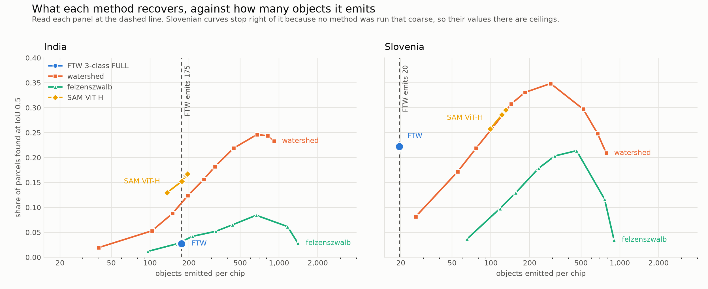

# Field boundaries for Indian smallholdings from Sentinel-2

Running a published field-boundary model on new ground is easy. The hard part
is working out whether a poor result means the imagery is too coarse or the
model is wrong, because the two lead to opposite advice: buy finer imagery, or
change method. This project separates them for Indian smallholdings, using
Fields of The World (FTW) with Slovenia as the control.

This page is the summary. `COMPARISON.md` has the full method, every table and
the corrections log. The [interactive map](https://sruthi-swathandran.github.io/geospatial-portfolio/02-field-boundaries-smallholder/docs/) puts every test chip on the
ground and shows what each method found on it.

---

## What holds

**1. On India, methods never trained on a field boundary still beat FTW.**
The best public FTW checkpoint, v3 with an EfficientNet-B7 encoder, recovers
12.9% of labelled Indian parcels. Read at the same object count it emits, 245
per chip, watershed and SAM do better:

| method, India, at v3 B7's 245 objects per chip | recall |
|---|---:|
| SAM ViT-H, colour infrared, read at 222 objects | 18.31% |
| watershed | 14.83% |
| FTW v3, EfficientNet-B7 | 12.91% |

SAM cannot draw more than 222 objects per Indian chip, so it is read there,
with fewer objects than FTW, and its lead of 5.40 points stands. Watershed's
lead is 1.92 points, with an interval from +0.21 to +3.59.

This project first tested FTW's v1 checkpoint of October 2024 and called it the
released state of the art, after FTW had replaced it (B-24). v1 recovers 2.7%.
At its 175 objects per chip SAM reached 0.158, watershed 0.107 and
felzenszwalb 0.031, and random Voronoi cells at the same count, which never see
the imagery, beat v1 in 3 of 200 draws. SAM's figures are on the composites
intended; its first run used the wrong bands and moved by half a point when
corrected (B-23).

**2. On Slovenia FTW works, and v3 works better.** v3 B7 recovers 33.1% of
parcels from 20.5 objects per chip. It beats every SAM composite, at 21.2% to
25.7%, though SAM draws 73 to 86 objects, and watershed at the same 20.5
objects recovers 6.3%. v1 recovered 22.2% from 20 objects, and 42.1% of the
objects it emits match a real parcel, against 4.4% for watershed. Slovenia has
a complete cadastre, so that is precision. FTW is a good model failing on
India.

**3. Resolution does not explain the Indian failure.** Both countries are the
same 10 m Sentinel-2. If the imagery set the limit, a parcel of a given ground
width would be found about as often in each. It is not:

| ground width | method | India | Slovenia | ratio |
|---|---|---:|---:|---:|
| 20 to 30 m | FTW v1 | 0.41% | 7.89% | 19.3x |
| 30 to 50 m | FTW v1 | 0.58% | 23.62% | 41.0x |
| 50 m up | FTW v1 | 7.11% | 58.80% | 8.3x |
| 30 to 50 m | watershed | 22.49% | 47.64% | 2.1x |
| 50 m up | watershed | 41.33% | 71.10% | 1.7x |
| 30 to 50 m | SAM ViT-H natural colour | 9.23% | 34.48% | 3.7x |
| 50 m up | SAM ViT-H natural colour | 36.44% | 68.57% | 1.9x |

Slovenia wins every band by every method, 1.7 to 41.0 times. Its labelled
parcels are also narrower than India's, 30.4 m against 42.3 m at the median.
FTW v3 B7 narrows the ratios and keeps the order: about 17 times at 20 to 30 m,
8 at 30 to 50 m and 2.3 at 50 m up.

**4. Neither do the Indian labels.** India's labels are hand-drawn, five per
chip. Measured against the image gradient, among parcels over 50 m across they
sit closer to the visible edge than Slovenia's, +1.81 m against +2.23 m, and
India is still found 8.3 times less often.

**5. The v1 checkpoint misses Indian parcels.** It puts no object at all on 74.4%
of them. SAM, spending a similar budget on 100 test chips, reaches 91.3% of
labelled parcels where FTW reaches 24.7%, measured on its first run's inputs.
On the largest Indian fields, over about 100 m across, SAM recovers 50.8%
against FTW's 17.5%, the one result here close to practical use.

**6. Nor does parcel shape.** Slovenian parcels are more strip-like than
India's. Given India's mix of widths and shapes, Slovenia is still found 10.7
times as often by FTW v1, against 11.5 times when only widths are matched.

**7. Nor does the season, beyond a small part.** FTW's second image for India
is from March to June, the dry months after the rabi harvest, and it works
against the v1 checkpoint. Given the kharif image twice instead, FTW finds 4.79%
of Indian parcels against 2.72%. An image from December to February, when
rabi crops are standing, helps by the same amount and no more, in both rabi
seasons tested. The best arrangement still leaves India about four times
below Slovenia.

**8. FTW's own later training is the largest change measured.** v3 lifts India
from 2.7% to 12.9%, and nearly all of that gain is above its null, so it comes
from better placed boundaries. India rises from 0.12 to 0.39 of Slovenia with
the same checkpoint. The gain is on parcels 30 m and wider; below that every
checkpoint stays near 1%.

**What is still open** is why even v3 reads Indian field edges so much worse
than Slovenian ones. Width, shape, label placement and season each explain
little. The labelled Indian boundaries carry a weaker image gradient than
Slovenia's, 1.297 times their interior against 1.588, but a blind check
against one analyst agreed with that measure only weakly. Watershed finds
about as many boundaries in the December to February image as in kharif,
while v1 given that image does no better, so the edges are in the imagery.
No checkpoint has been fine-tuned on Indian chips here. FTW reports fine-tuning
a model trained without India moving it from 0.14 to 0.19 in its own scoring.



---

## Why the comparison is at a matched object count

Recall rewards producing more objects: a method that cuts a chip into six
hundred pieces has better odds of one fitting a parcel. The first version of
this comparison let each method choose its own count, and watershed appeared to
beat FTW. Every figure here is read at the checkpoint's own count, beside a
random-cell null at the same count, after FTW's own 500 m² minimum object size
is applied to every method. `COMPARISON.md` explains each control.

---

## Limits

- **Indian labels are presence-only.** Five parcels per chip are drawn and
  98.96% of each chip carries no label, so India gives recall and only a floor
  on precision.
- **Against v1, most Slovenian figures at the budget are bounds.** Watershed
  has been measured there. Felzenszwalb and SAM were not run coarse enough to
  reach 20 objects per chip. Against v3, SAM loses while drawing more objects,
  so that comparison stands.
- **Most tables show FTW v1.** The later checkpoints are in findings 18 and
  19 of `COMPARISON.md`. The figure below and the interactive map show both.
- **FTW's FULL checkpoints carry noncommercial terms** from some of their
  training labels. v3.1 is the CC-BY version, and it probably did not see
  Slovenia, which flatters its India to Slovenia ratio.
- **The parcel reconstruction is bounded, not validated.** FTW erodes each
  parcel's edge and this project gives it back. Varying that step moves no
  recall by more than 0.0017, but it has never been checked against
  independently digitised parcels.
- **A few SAM figures rest on its first run.** Precision on 100 chips and the
  reconstruction sweep used near infrared, blue and green (B-23).
- **The contrast measure rests on one analyst's eye** and 20 parcels.
- **Settings were chosen on the data they are reported from.** Measured on 40
  held-out splits, that is worth at most 0.0066 of recall.
- **Intervals resample whole chips**, since parcels in one chip share a scene.
  FTW v1's headline figures are 2.72% [1.71, 3.88] in India and 22.22%
  [18.56, 25.88] in Slovenia, and v3 B7's 12.91% [10.66, 15.08] and 33.06%
  [29.00, 36.73].

---

## How far to trust it

`REVIEW.md` is a technical review of the project written with an AI
assistant, Claude. It is not independent peer review. It lists 21 findings,
and every one is now closed or scoped with the reason stated.

`COMPARISON.md` carries 26 corrections, B-01 to B-26, each with the published
value, the corrected one and why the first was wrong. The largest: FTW ships Slovenia on pixels 4.14 m across and 6.00 m
tall, and treating them as square had overstated the cross-country gap by up to
forty per cent. The conclusion survived the correction.

Two checks guard the numbers. `src\check_tables.py` fails if any number in a
table in `COMPARISON.md` cannot be traced to a table generated from the result
files. `results/run_manifest.json` records the interpreter, package versions,
checkpoint hashes, seeds and a hash of every output, and
`src\run_manifest.py --compare` says whether a rerun reproduced them.

---

## Data and running it

Open data only. Nothing here comes from any private, client or internal source.

| source | what | licence |
|---|---|---|
| [Fields of The World](https://source.coop/kerner-lab/fields-of-the-world) | chips and labels | per country, listed on that page; Slovenia's labels CC-BY-SA-4.0 (B-25) |
| [FTW baseline checkpoints](https://github.com/fieldsoftheworld/ftw-baselines/releases), v1 to v3.1 | the trained models | CC-BY-4.0 for the CC-BY checkpoints; the FULL ones carry the terms of their noncommercial training data |
| Copernicus Sentinel-2 | the imagery behind the chips | Copernicus / ESA terms |
| Copernicus Sentinel-2 L2A via [Microsoft Planetary Computer](https://planetarycomputer.microsoft.com/) | the December to February images | Copernicus / ESA terms |
| [Segment Anything](https://github.com/facebookresearch/segment-anything) | SAM ViT-H checkpoint | Apache 2.0 |
| [geoBoundaries](https://www.geoboundaries.org/) | district polygons | CC BY 4.0 |
| [Sentinel-2 cloudless 2020](https://s2maps.eu) by EOX | background of the interactive map only | CC BY-NC-SA 4.0 |

399 Indian test chips and 228 Slovenian, 1,983 and 6,831 labelled parcels,
scored by object recall at IoU 0.5. CPU only, Python 3.11.9:

```
pip install torch==2.14.0 torchvision==0.29.0 ^
    --index-url https://download.pytorch.org/whl/cpu
pip install -r requirements.txt
```

The full run order is at the end of `COMPARISON.md`. The classical sweep takes
about half an hour per country and SAM about 16 hours for India.

`FINDINGS.md` measures the reference data before any model runs, `RESULTS.md`
runs FTW against it, `COMPARISON.md` sets the other methods beside it, and
`REVIEW.md` is the technical review of all three.

Stage 3, a district-level breakdown across Indian agro-climatic zones, is
started and not finished.

---

## Licence and citation

Code is released under the MIT Licence. The data carry their own terms, listed
above. This work contains modified Copernicus Sentinel data, processed through
the Fields of The World benchmark.

Suggested citation:

> Swathandran, S. (2026). *Field boundaries for Indian smallholdings from
> Sentinel-2: what the published model recovers, and what an untrained
> baseline recovers beside it.*
> github.com/sruthi-swathandran/geospatial-portfolio

Questions and issues: please open a GitHub issue on this repository.
